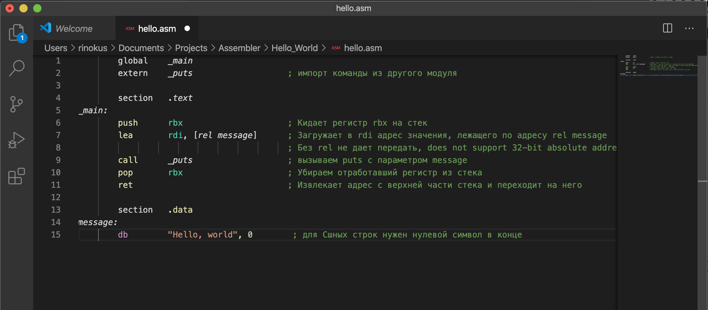

## Соколовский Вацлав, БПИ191

Домашнее задание ко второму семинару по Архитектуре вычислительных систем.

## 1 программа

Примером послужил Hello World код с 32-х битного NASM, который у меня не хотел компилироваться.

- **Код программы** 
   
  Как можно заметить программа создает диалоговое окно. Если нажать "Да", то будет запущена следующая часть программы, находящаяся внутри условного оператора.
 **Результат выполнения после нажатия программы в консоли** 
   
---
