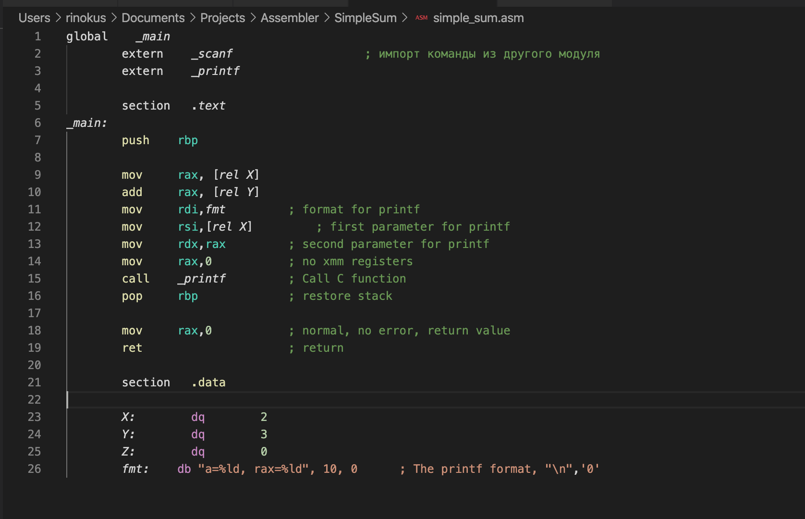
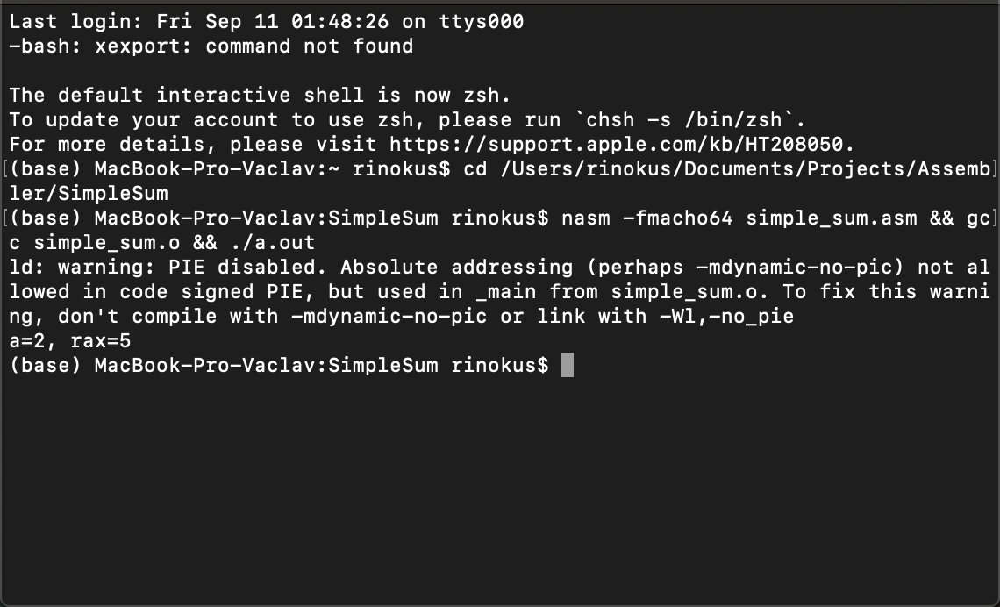
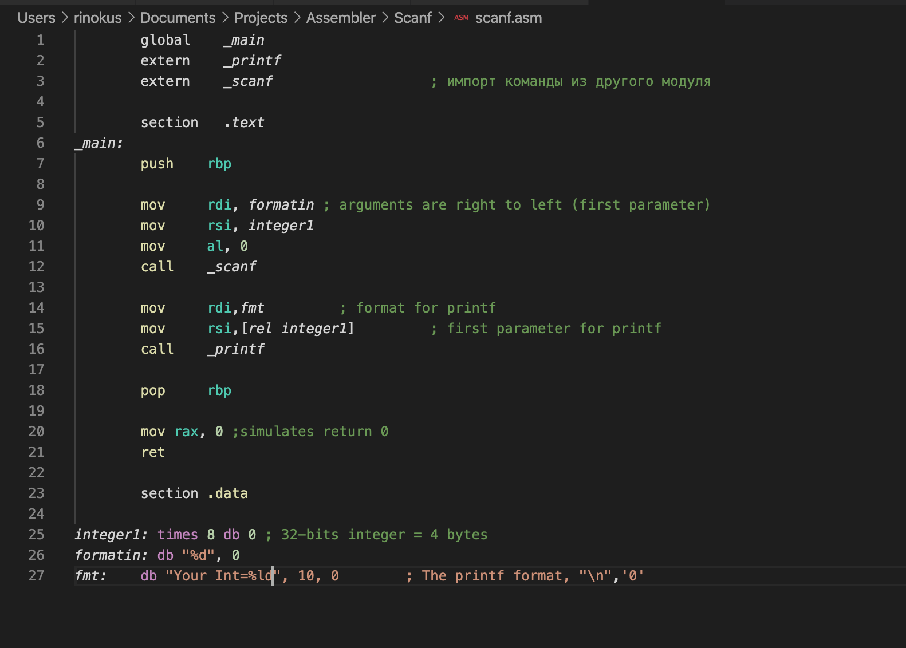
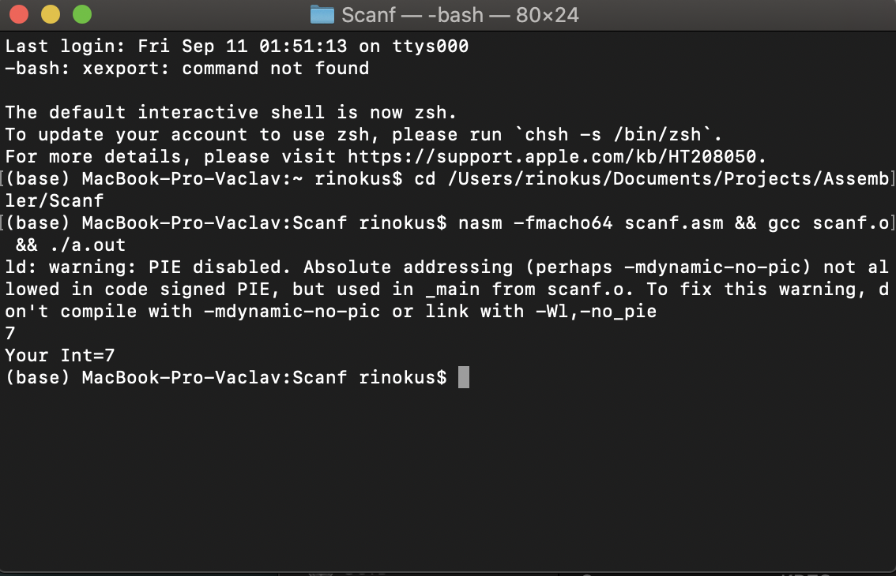
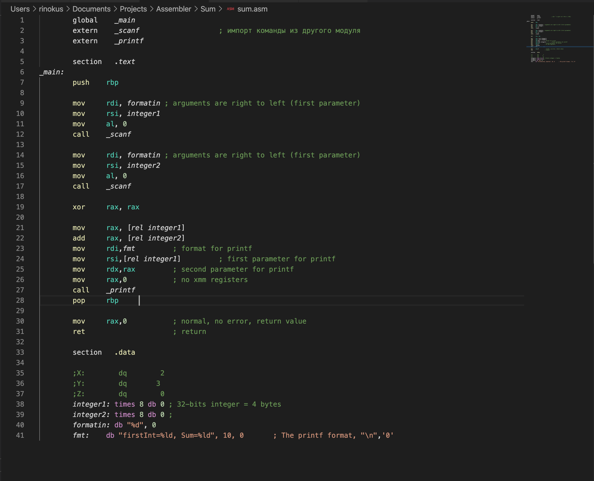
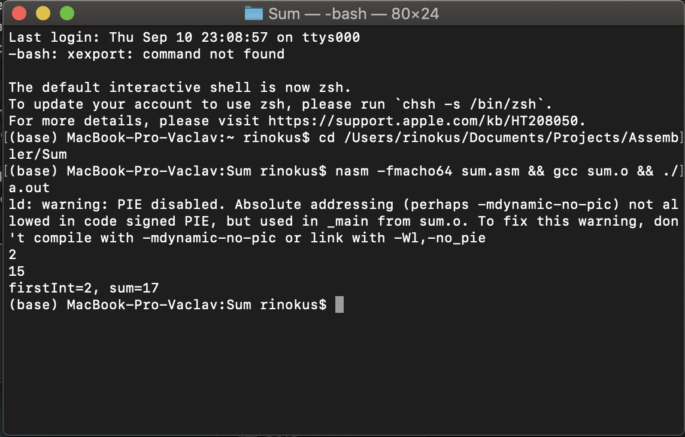

## Соколовский Вацлав, БПИ191

Домашнее задание ко второму семинару по Архитектуре вычислительных систем.

## 1 программа

Примером послужил Hello World код с 32-х битного NASM, который у меня не хотел компилироваться.

- **Код программы** 
   

- **Результат выполнения после запуска программы в консоли** 
Если через консоль создать объектный и исполняемый файлы программы и запустить исполняемый, то увидим заветную запись.
   
---
## 2 программа

Эта программа просто складывает две константы. Примером также послужила 32-х битная версия

- **Код программы** 
   
  
- **Результат выполнения после запуска программы в консоли** 
Если через консоль создать объектный и исполняемый файлы программы и запустить исполняемый, то увидим заветную запись.
   

---

## 3 программа

Программа вызвавшая наибольшую боль, ибо поиск замены функции push (не работает в 64-х битной версии) заключался в методе тыка (мувов в разные регистры)

- **Код программы** 
   
  
- **Результат выполнения после запуска программы в консоли** 
Если через консоль создать объектный и исполняемый файлы программы и запустить исполняемый, то увидим заветную запись.
   
---

## 4 программа

Последняя программа - слияние 2-й и 3-й программ. Считывает значения с консоли, выводит сумму.

- **Код программы** 
   
- **Результат выполнения после запуска программы в консоли** 
Если через консоль создать объектный и исполняемый файлы программы и запустить исполняемый, то увидим заветную запись.
   

---
