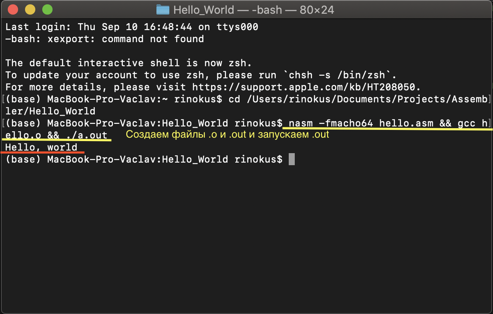

## Соколовский Вацлав, БПИ191

Домашнее задание ко второму семинару по Архитектуре вычислительных систем.

## 1 программа

Примером послужил Hello World код с 32-х битного NASM, который у меня не хотел компилироваться.

- **Код программы** 
   
  Если через консоль создать объектный и исполняемый файлы программы и запустить исполняемый, то увидим заветную запись.
- **Результат выполнения после запуска программы в консоли** 
   
---
